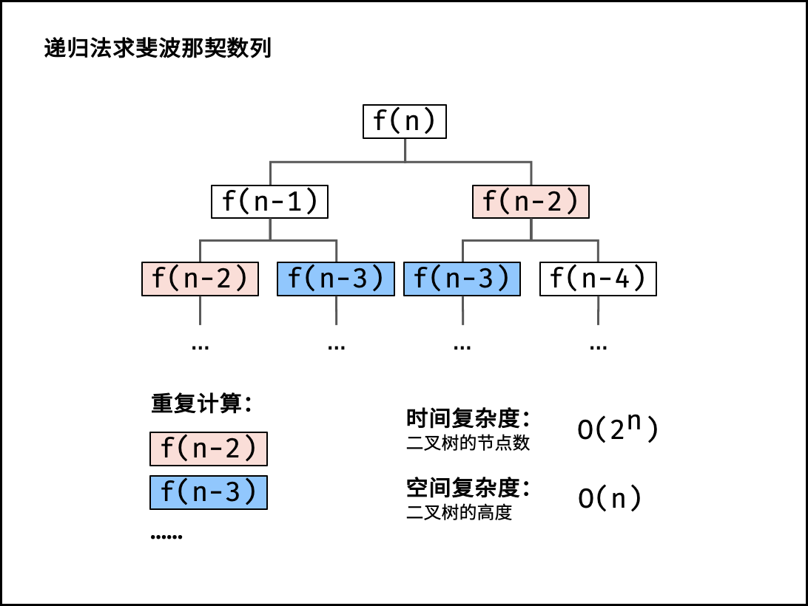

:::note[阅读介绍]
> 本篇是动态规划专题---一维动态规划的知识
> **从暴力递归入手逐步入手一维动态规划。**
> 1. `刷题网站:洛谷，leetcode, 牛客网`。 网站链接自寻！
> 2. `参考: 《程序员代码面试指南》 & 代码随想录。 每道题后我都会附带链接， 代码会上传到GitHub上`
> 3. 基础: 笔者应当熟练**递归算法**的使用。
> 4. 编程语言: **Java**---借助**chatgpt**转换成自己的语言吧！
> 5. **IDE：Intellij IDEA。 主题: MonoKai pro ; 字体: Fira cod light。** Coding很舒服---自行安装相关插件
>6. 涉及容器: 数组, 哈希表
>7. 目前读过的数据结构和算法书籍：《大话数据结构（C语言）》，《数据结构和算法分析（Java语言描述）》，《算法导论》， 《程序员代码面试指南》。
>8. 恩师:左程云。下面题目遇到任何的问题都可以观看偶像的视频讲解解决-自行搜索对应视频:[课程链接和代码仓库<-](https://dreamkikiqiu.github.io/dreamkikiqiu/about/)
:::


:::tip[提示]

- 题目通过000~999进行编号， 不过网站暂未提供目录结构无法快速寻找相关题目（不好意思）🥲。
- 标题可以点击跳转页面。每道题都配有相关链接。 函数题一般是leetcode, acm风格是牛客和洛谷的。 处理输入输出的题的类里多数有main函数可以自行运行测试。
- 每道题都可以ctrl + c, ctrl + v提交。**注意:修改类名， 函数名，递归调用函数;不要提交无关的类。**
- 思考和coding, 并非速度和ac数目。😘

:::

### 动态规划
动态规划: **空间换取时间**， **解决出现求解重复递归子问题的解。 **

比如,有个函数`f(array,i,j,ans)`求解这个问题， 那么如果递归过程中出现了参数值完全相同的情况， 那么这就是重复求解了。
动态规划就是通过空间来避免求解重复问题，
暂时说到这儿。
下面， 来完成后面的题，逐步展开感受。

#### **001[斐波那契数列](https://leetcode.cn/problems/fibonacci-number/)**

>斐波那契数列通常表示为 ，它F(n)形成一个序列，称为斐波那契数列，其中每个数字都是前两个数字之和，从0和开始1。也就是说，

$$
0, 1, 1, 2, 3, 5, 8, 13, 21, 34...
  , { 满足 f(0) = 0, f(1) = 1, 
f(n) = f(n-1) + f(n-2), n > 1.}
$$

斐波那契数列的有三种时间复杂度的解$O(2^n), O(n), O(logn)。$
初学者一般学过斐波那契数列的指数和线性时间的解法。对数时间是矩阵快速幂的解法， 这个是最优解(快速幂篇幅再说)。

`解法一:`
```java
 //提交时函数名-> fib
    public static int fib1(int n){
        if(n==0){
            return 0;
        }
        else if(n==1){
            return 1;
        }
        else{
            //n > 1由斐波那契数列的递推公式
            return fib1(n-1) + fib1(n-2);
        }
    }
```
这种解法估计是大多数朋友熟悉的一种写法， 它是最优解吗？
不是， 它是最差的$O(2^n)$的时间复杂度。
这问题就在于对于`f(n)`,`f(n-1)`均要求解`f(n-2)`, 但明显计算机不知道之前求过了， 进行大量的重复子问题计算。

从递归树角度分析， 它的最长路径是`n`，最短路径`n/2`， 由放缩法可近似认为， 它时间复杂度基于高度为`n/2`和`n`的递归树之间， 可以认为时间复杂度就是指数级， 而并非想象中的线性时间。


我们如何避免重复求解？
计算机不会记住， 但我们可以放一个表上告诉它哪些数据之前求过可以之间"拿", 哪些数据需要求解。
这种技巧被称之为**记忆化搜索， 记忆化dfs（记忆化递归）**。相比解法1， 无脑dfs疯狂地求解重复子问题， 太糟糕了！。 
这种时间复杂度是$O(n)$.为什么？相当于**递归剪枝**。

这种解法与递归紧密相连， 一旦写出递归求法改成记忆化搜索非常容易。
下面是解法二的流程
`解法二:记忆化搜索:`
前面提过要用表存储求解过子问题的值。
表具体是什么？ **数组或者哈希表！**

由于要存储每个子问题的值， 那么需要多大的数组或者哈希表呢？
以这道题说明， 我们要求解`fib(n)`, 那么要存储第`0,1,2,...n-1,n`的子问题的值， 参数为n就是最终求解的值。

1. 确定表的维度和大小， 这里是一维数组和`n+1`的长度。
2. 初始化`缓存表`, 指定它们为一个无效值(-1, 取决于是否对求解问题本身有影响)。
3. 如果表中存入对应子问题的解， 直接取值。 否则，在求解子问题过程加入将解写入表的额外步骤。

```java
//解法二；提交时函数名-> fib
    public static int fib2(int n){
        int[] dp = new int[n+1];
        Arrays.fill(dp,-1);
        f(n,dp);
        return dp[n];
    }

    public static int f(int n,int[] dp){
        if(n==0){
            return 0;
        }
        if(n==1){
            return 1;
        }
        int ans = f(n-1,dp) + f(n-2,dp);
        dp[n] = ans;
        return ans;
    }
```

当f函数的参数与之前求解过的完全相同， 那么说明这个问题求解过。 直接读表， 避免了重复递归调用的过程，节省时间了。

但有必要这么麻烦吗？斐波那契数列已知前两项0，1可以推出第三项。 已知前两项， 推出下一项是非常容易的。
那好，可以搞一个dp表。初始化前两项， 然后循环依次推出第n项的最优解。
`解法3`
```java
public static int fib3(int n){
        if(n==0){
            return 0;
        }
        if(n==1){
            return 1;
        }
        int[] dp = new int[n+1];
        dp[0] = 0;
        dp[1] = 1;
        for(int i=2;i<=n;i++){
            dp[i]=dp[i-1]+dp[i-2];
        }
        return dp[n];
    }
```

没必要像解法3开一个n+1长度的dp表。
`dp[i]=dp[i-1]+dp[i-2];`, 只需要3个滚动更新的变量即可。`cur,last,lastLast`常数个空间即可完成。
这就是线性时间且省空间的做法
`解法4`:
```java
 //解法4 线性时间且省空间的最优解。
    public static int fib4(int n){
        if(n==0){
            return 0;
        }
        if(n==1){
            return 1;
        }
        int lastLast = 0;
        int last = 1;
        int cur = 0;
        for(int i=2;i<=n;i++){
            //求解答案
            cur = lastLast + last;

            //为一次求解滚动更新
            lastLast = last;
            last = cur;
        }
        return cur;
    }

```

还有一种通项公式法， 斐波那契数列有通项公式， 可以根据它的数学表达式用`sqrt`,`pow`函数求解， 不过由于其本身是浮点数， 容易丢失精度。另外,它的时间复杂度不是$O(1)$， 其实也是用了`矩阵快速幂`的方法 $O(logn)$, 因此这种方法可以忽略， 去学习矩阵快速幂的方法即可， 本篇不涉及。


#### **002[最低票价](https://leetcode.cn/problems/minimum-cost-for-tickets/description/)**
> 最低票价
 在一个火车旅行很受欢迎的国度，你提前一年计划了一些火车旅行
 在接下来的一年里，你要旅行的日子将以一个名为 days 的数组给出
 每一项是一个从 1 到 365 的整数
 火车票有 三种不同的销售方式
 一张 为期1天 的通行证售价为 costs[0] 美元
 一张 为期7天 的通行证售价为 costs[1] 美元
 一张 为期30天 的通行证售价为 costs[2] 美元
 通行证允许数天无限制的旅行.

举例:
>输入： days = [1,4,6,7,8,20], cost = [2,7,15]
输出： 11
解释：例如，这里有一种购买通票的方式，可以让你按照自己的旅行计划出行：
第 1 天，您购买了 1 日通票，价格为 cost[0] = $2，涵盖第 1 天的费用。
第 3 天，您购买了 7 天通票，费用为 cost[1] = 7 美元，涵盖第 3、4、...、9 天。
第 20 天，您购买了 1 日通票，价格为 cost[0] = $2，涵盖第 20 天。
总计您花费了 11 美元，涵盖了所有旅行天数。

`[1,4,6,7,8,20]`
有三种票价可以帮助维持对应的天数。
第一种票价，为期一天， 可以帮助你度过一天。
第二种票价，为期7天，从你当前天出发， 比如你从第一天买了为期7天的票，持续`[1,6]`的闭区间， 刚好7天。
第三种票价。为期30天。对于这个样例，从第一天开始直接买30天的直接不要考虑后续天的买票了， 整个旅行的票价就是这个。

`暴力递归必定超时`
```java
 public static int[] durations = new int[]{1, 7, 30};
    //递归方法
    //提交时修改函数名-> mincostTickets ps:暴力递归无法通过
    public static int mincostTickets(int[] days, int[] costs) {
        //f函数表示从days[0]出发到days数组旅行结束要多少天。
        //f首先从0处开始
        return f(days,0,costs);
    }

    public static int f(int[] days,int cur,int[] costs){
        //当旅行到days边界， 那么没有开销了。 递归基线条件
        if(cur>=days.length){
            return 0;
        }

        //下面开始求三种costs方案的最小值
        //循环遍历三次即可。枚举三次

        //ans初始为系统最大值
        int ans = Integer.MAX_VALUE;
        for(int k=0, j = cur;k<3;k++){

            //依次根据三种方案， 确认days中递归函数对应索引处。
            while(j < days.length && days[cur] + durations[k] > days[j]){
                j++;
            }

            //比较
            ans = Math.min(ans, costs[k] + f(days, j, costs));
        }
        return ans;
    }
```

超时的原因， 我只是简单阐述。 原因在于三种方案可能会多次递归调用同一个参数的函数。 比如选择方案一和选择方案二出现了重复的j，上面例子中的f函数days，costs数组是固定的，唯一变量是j。

重复递归地求解子问题是一种莽的做法， 但不可否认它非常好想。
递归解法对应了动态规划中的记忆化搜索技巧。
非常好改。

`记忆化dfs`:
```java
//单独提交这个解法， 取消下面durations数组的注释

    //public static int[] durations = new int[]{1, 7, 30};
    //暴力递归->动态规划、
    //提交时修改函数名 mincostTickets
    public static int mincostTickets2(int[] days, int[] costs) {
        //确定dp表的维度和范围
        int[] dp = new int[days.length];
        //初始化为一个无效值
        Arrays.fill(dp,-1);
        return f1(days,0,costs, dp);//带着缓存表一起（传参）
    }

    public static int f1(int[] days,int cur,int[] costs,int[] dp){
        if(cur >= days.length){
            return 0;
        }
        //先前存储过， 那么直接读表
        if(dp[cur] != -1){
            return dp[cur];
        }
        //否则， 在暴力递归地过程中加入写入dp表的步骤
        int ans = Integer.MAX_VALUE;
        for(int k=0, j = cur;k<3;k++){
            while(j<days.length && days[cur] + durations[k] > days[j]) j++;
            ans = Math.min(ans, costs[k] + f1(days,j,costs,dp));
        }
        dp[cur] = ans;
        return ans;
    }
```


谈谈最后一种解法， 位置依赖和自底向上的求法。
先找一个初始值， 怎么找？从前面的递归基本条件找。
```java
 if(cur >= days.length){
    return 0;
}
```
这表示days数组走完了， 那么不需要开销了。 即花费0。
只保留相等的情况， 当数组在第days.length天的情况, 最低花费为0.
那么在前一天的最低花费是不是很好求， 枚举三种方案找到从`days.length-1`到`days.length`的最低费用， 而days.length的最低费用是0,不需要求了。

因此位置依赖的迭代动态规划写法， 是逆序求的。
```java
//解法3
    //迭代自底向下的位置依赖方法
    public static int mincostTickets3(int[] days,int[] costs){
        int n = days.length;
        //此时dp表的含义表示: 从当前days索引i处出发完结旅行的最低费用
        int[] dp = new int[n+1];
        Arrays.fill(dp,-1);
        dp[n] = 0;
        //从n-1 -> 0处逆序求解的过程
        for(int i=n-1;i>=0;i--){

            //老样子枚举
            int ans = Integer.MAX_VALUE;
            for(int k=0,j=i;k<3;k++){
                while(j<days.length && days[i] + durations[k] > days[j]) j++;
                ans = Math.min(ans, costs[k] + dp[j]);//递归函数改为dp表中读值
            }
            dp[i]  =ans;//更新
        }
        return dp[0];
    }

```


根据力扣本题的范围搞一个全局的dp表。
```java
//解法4
    //提交时修改函数名为 mincostTickets
    //根据本题范围的最优解
    public static int MAX = 366;
    public static int[] dp = new int[MAX];
    public static int mincostTickets4(int[] days,int[] costs){
        int n = days.length;
        Arrays.fill(dp,0,n+1,-1);
        dp[n] = 0;
        //从n-1 -> 0处逆序求解的过程
        for(int i=n-1;i>=0;i--){

            int ans = Integer.MAX_VALUE;
            for(int k=0,j=i;k<3;k++){
                while(j<days.length && days[i] + durations[k] > days[j]) j++;
                ans = Math.min(ans, costs[k] + dp[j]);//递归函数改为dp表中读值
            }
            dp[i]  =ans;//更新
        }
        return dp[0];
    }

```