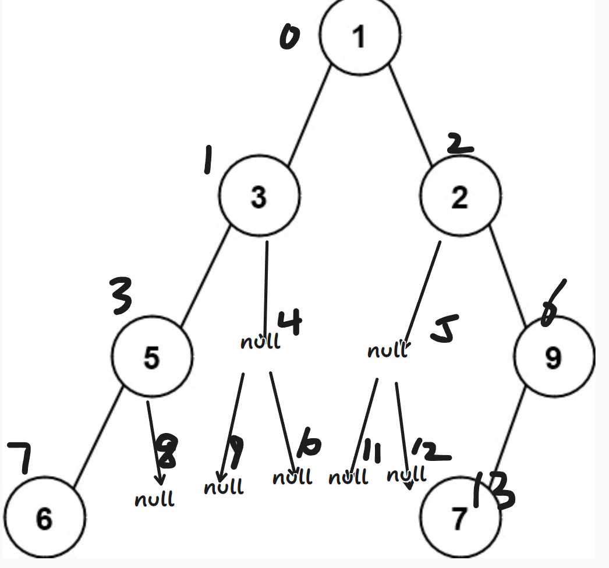
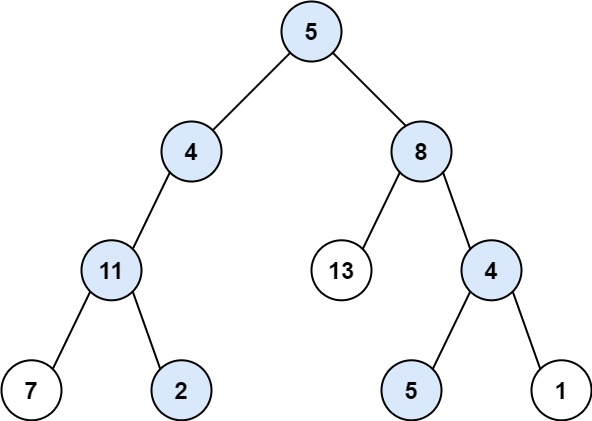

:::note[阅读说明(必看)]
本篇二叉树专题，读者应该具备一定的数据结构和算法能力。
>1. `刷题网站:洛谷，leetcode, 牛客网 `。 网站链接自寻！
>2. `参考: 《程序员代码面试指南》 & 代码随想录。 每道题后我都会附带链接， 代码会上传到GitHub上`
>3. 基础部分简略(任意教材都能找到的内容， 初学者都会的内容); 进阶部分有一定思考难度和coding挑战;拓展部分学得更加有深度。 上难度的平衡树有序表(treap, spaly, 红黑树这些)基本不会涉及。
>4. 编程语言: 笔者热爱**Java**, 主要以Java语言为主。 对于某些情况下（递归析构）会尝试提供C++代码。---借助**chatgpt**转换成自己的语言吧！
>5. **IDE：Intellij IDEA。 主题: MonoKai pro ; 字体: Fira cod light。** Coding很舒服---自行安装相关插件
>6. 容器和算法技巧: 栈， 队列， 哈希表， 数组； 递归， 分治， 对于部分可以使用动态规划的题也会提供解释。 读者应当可以用数组手搓栈和队列结构
>7. 目前读过的数据结构和算法书籍：《大话数据结构（C语言）》，《数据结构和算法分析（Java语言描述）》，《算法导论》， 《程序员代码面试指南》。
>8. 恩师:左程云。下面题目遇到任何的问题都可以观看偶像的视频讲解解决-自行搜索对应视频:[课程链接和代码仓库<-](https://dreamkikiqiu.github.io/dreamkikiqiu/about/)
:::

:::tip[提示]
- 题目通过000~999进行编号， 不过网站暂未提供目录结构无法快速寻找相关题目（不好意思）🥲。
- 标题可以点击跳转页面。每道题都配有相关链接。 函数题一般是leetcode, acm风格是牛客和洛谷的。 处理输入输出的题的类里多数有main函数可以自行运行测试。
- 每道题都可以ctrl + c, ctrl + v提交。**注意:修改类名， 函数名， 不要提交无关的类。**
- 思考和coding, 而不是注重题量和速度哦。😘
:::


:::note[Class01遍历]

#### **Coding[基础]力扣经典三问:递归以及非递归版本三序遍历**

##### **001 [先序遍历-递归版](https://leetcode.cn/problems/binary-tree-preorder-traversal/description/)**
**基础回顾: 先序遍历（前序遍历）: 对于树及其子树始终遵循 根 > 左 > 右的优先级顺序。** 
```java
    //辅助preorderTraversalRec的方法
    private void f(TreeNode head, List<Integer> list){
        if(head != null){
            list.add(head.val);
            f(head.left, list);
            f(head.right, list);
        }
    }
    //主方法, 修改函数名->preorderTraversal
    public List<Integer> preorderTraversal(TreeNode head){
        List<Integer> list = new ArrayList<>();
        f(head, list);
        return list;
    }
```
-----
从递归来看， 这道题可以理解为**根节点 + 左子树先序生成的列表 + 右子树先序生成的列表**。 于是有了第二种更好看的递归写法。
由于这里列表相加， Java中调用了`addAll`方法。
```java
    /**
     * 修改函数名->preorderTraversal
     * 由于递归，函数体内部代码也要调整。
     */
    public List<Integer> preorderTraversalRec1(TreeNode head){
        List<Integer> list = new ArrayList<>();
        if(head != null) {
            list.add(head.val);
            list.addAll(preorderTraversalRec1(head.left));
            list.addAll(preorderTraversalRec1(head.right));
        }
        return list;
    }
```

##### **002 [中序遍历-递归版](https://leetcode.cn/problems/binary-tree-inorder-traversal/description/)**
**基础回顾: 中序遍历: 对于树及其子树始终遵循 左> 根 > 右的优先级顺序。** 

```java
    //辅助inorderTraversalRec的方法
    private void f2(TreeNode head, List<Integer> list){
        if(head != null){
            f2(head.left, list);
            list.add(head.val);
            f2(head.right, list);
        }
    }
    //主方法  修改函数名->inorderTraversal
    public List<Integer> inorderTraversalRec(TreeNode head){
        List<Integer> list = new ArrayList<>();
        f2(head, list);
        return list;
    }
```
-----------------
从递归来看， 这道题可以理解为**左子树先序生成的列表+ 根节点 + 右子树先序生成的列表**， 同先序遍历起仅仅挪动一下位置。
```java
    /**
     * 修改函数名->inorderTraversal
     * 由于递归，函数体内部代码也要调整。
     */
    public List<Integer> inorderTraversalRec1(TreeNode head){
        List<Integer> list = new ArrayList<>();
        if(head != null) {
            list.addAll(inorderTraversalRec1(head.left));
            list.add(head.val);
            list.addAll(inorderTraversalRec1(head.right));
        }
        return list;
    }
```

##### **003 [后序遍历-递归版](https://leetcode.cn/problems/binary-tree-postorder-traversal/description/)**
**基础回顾: 后序遍历: 对于树及其子树始终遵循 左> 右 >根的优先级顺序。** 
```java
    //辅助方法
    private void f3(TreeNode head, List<Integer> list){
        if(head != null){
            f3(head.left, list);
            f3(head.right, list);
            list.add(head.val);
        }
    }
    //主方法  修改函数名->postorderTraversal
    public List<Integer> postorderTraversalRec(TreeNode head){
        List<Integer> list = new ArrayList<>();
        f3(head, list);
        return list;
    }
```
----------------------------
思想与上述一致， 只是改变一下顺序。
```java
    /**
     * 修改函数名->postorderTraversal
     * 由于递归，函数体内部代码也要调整。
     */
    public List<Integer> postorderTraversalRec1(TreeNode head){
        List<Integer> list = new ArrayList<>();
        if(head != null){
            list.addAll(postorderTraversalRec1(head.left));
            list.addAll(postorderTraversalRec1(head.right));
            list.add(head.val);
        }
        return list;
    }
```

##### 004 [先序遍历-非递归](https://leetcode.cn/problems/binary-tree-preorder-traversal/description/)
所有递归的方法都可以改成迭代的形式， 区别在于递归是通过系统栈的方式， 系统栈中存储信息。 而迭代是通过我们手动压栈的方式， 一般的递归方法都可以用栈很好模拟实现， 因为本质是一回事， 不过函数栈隐藏了细节， 一般来说递归更加直白易懂， 而栈模拟的迭代方式有点"恶心"了。

先序的处理方式: 
1. 处理根节点。
2. 尽可能深的处理左子树。
3. 左子树必须处理完后， 再继续处理右子树。
4. 以上规则适用任意整棵树及其子树。

算法流程:
1. 申请一个栈(Java内置栈或者全局静态数组手写栈)， 将当前树的根节点压入栈中。
2. 然后弹栈将弹出节点保存在变量cur中，**处理节点cur**。 **先压右子树再压左子树（节点存在就压栈！！）**。
3. 重复2的过程， 直到栈空了， 结束。

合理性:
左树优先右树， 左树不处理完不能处理右树。
**先压右，再压左。 栈的后进先出特性！左被优先处理， 左树被处理又会带来新的左右节点(如果存在)， 那么循环这个过程。直到左树处理干净， 然后处理右树（也是这套逻辑）。**

`代码`
```java
    //提交修改函数名 ->preorderTraversal
    public List<Integer> preorderTraversalUnRec(TreeNode head) {
        List<Integer> list= new ArrayList<>();
        if(head != null){
            //申请一个栈
            Stack<TreeNode> stack = new Stack<>();
            //先压根节点
            stack.push(head);
            while(!stack.isEmpty()){
                //弹栈处理(加入列表)， 这里复用变量head.
                head = stack.pop();
                list.add(head.val);

                //先压右子树（如果存在）
                if(head.right != null){
                    stack.push(head.right);
                }
                //后压左子树（如果存在）
                if(head.left != null){
                    stack.push(head.left);
                }
            }
        }
        //返回结果。
        return list;
    }
```

##### **005 [中序遍历-非递归](https://leetcode.cn/problems/binary-tree-inorder-traversal/description/)**
如果没阅读， 优先看`004`前面的几段话。

中序的处理方式: 
1. 尽可能深的往左边界走，直到走尽（不能继续`.left`走了）。
2. 回退到上一个节点(这个节点没有左子树或者左子树被访问过了)， 那么处理这个根节点。 然后尝试向右走。
3. 以上规则适用任意整棵树及其子树。

算法流程:
1. 申请一个栈(Java内置栈或者全局静态数组手写栈)， **cur记录head节点， 然后遍历开始**
2. cur沿着"左边界"路径一直走， 收集节点到栈中。直到cur为null。
3. 栈中弹出一个节点（cur回退到上一个且没处理的节点）, 处理它。 尝试往右走`cur = cur.right`。
4. 重复2的过程， 直到cur往右走为null并且不能通过栈找到上一个到达但未处理的节点。 **人话:循环终止条件栈为空且cur也为空。**

`代码`:
```java
    //非递归中序版本: 提交修改函数名->inorderTraversal
    public List<Integer> inorderTraversalUnRec(TreeNode head) {
        List<Integer> list = new ArrayList<>();
        if(head != null){
            //申请一个栈
           var stack = new Stack<TreeNode>();
           //cur: 遍历二叉树,初始化为head
           var cur = head;
           //循环条件 栈不为空或者cur不为null
           while(!stack.isEmpty() || cur != null){
               if(cur != null){
                   //算法流程步骤2
                   
                   //压栈
                   stack.push(cur);
                   //继续往左走， 不到尽头不回头。
                   cur = cur.left;
               }
               else{
                   //算法流程步骤3
                   
                   //弹栈
                   cur = stack.pop();
                   //处理（加入列表）
                   list.add(cur.val);
                   //尝试往右走。
                   cur = cur.right;
               }
           }
        }
        return list;
    }
```

##### **006 [后序遍历-非递归](https://leetcode.cn/problems/binary-tree-postorder-traversal/description/)**
如果没阅读， 优先看`004`前面的几段话。

本题说明两种解法
###### 解法一: 双栈实现。
解法一必须先了解`004`思路。

后序双栈实现分析:
先序遍历非递归实现， 通过处理当前节点，然后先压右树后压左树。
借此， 实现*根 > 左 > 右*的顺序。
对比后序遍历，*左 > 右 > 根*的优先级。 观察一下， 发现根在最后， 逆置一下， *根 > 右 > 左*。
！ *根 > 右 > 左*很好实现。 只需要改造一下先序遍历的处理方式，
**先压左树后压左树**。 怎么逆置呢？用一个栈!在处理的时候不处理而是收集起来， 然后统一处理而且整体输出与输入完全逆序了。

算法流程:
1. 申请两个栈(Java内置或者全局静态数组实现栈)， 一个栈stack同先序遍历一样（根节点入栈）， 另一个栈collect用收集代替处理这一步。
2. 弹栈将弹出节点保存在变量cur中， **将cur收集起来（cur压入collect）！** **先压左树后压右子树（如果存在）。**
3. 重复2的过程直到栈为空。
4. 输出收集栈collect，按输出顺序处理。

```java
 //双栈迭代实现后序遍历 函数名->postorderTraversal
    public List<Integer> postorderTraversalTwoStacks(TreeNode head) {
        List<Integer> list = new ArrayList<>();
        if(head != null) {
            //步骤1:申请两个栈, 一个常规栈stack 另一收集栈collect
           var stack = new Stack<TreeNode>();
           var collect = new Stack<TreeNode>();
           //步骤1：根节点入栈
            stack.push(head);

            //步骤3:循环步骤2，直到栈stack为空。
            while(!stack.isEmpty()){
                //步骤2:弹栈， 复用head
                head = stack.pop();
                //步骤2: 收集栈收集节点(替代常规处理)
                collect.push(head);

                //步骤2:先压左子树后压右子树
                if(head.left != null){
                    stack.push(head.left);
                }

                if(head.right != null){
                    stack.push(head.right);
                }
            }

            //步骤4:逆序输出处理收集栈
            while(!collect.isEmpty()){
                list.add(collect.pop().val);
            }
        }
        //返回结果
        return list;
    }
```

###### 解法二: 单栈实现(优于解法一)🫡
能否少用一个栈呢? 先序遍历，中序遍历都用一个栈， 后序用两个栈是不是不太没排面了。

我们采用问答式和"一个可重复利用的标志"来说明算法流程。
想象一下，张三当前在最初的家中(假设村落里邻里分布可以认为一种二叉树结构， 张三家正好在村落的根节点处)， 张三是个路痴， 他要按照后序遍历依次拜访他的邻居们最后回到自己的家中。 现在我要帮助他找到正确的顺序。
张三提问
>1. 旁白:张三肯定不能直接上来回到他家中（因为后序遍历的特点）。
>2. 张三:我该前往哪个节点拜访邻居呢呢? 左或者右？ 为什么?
>3. 我:如果你左节点有邻居存在的话，那么你应该优先前往左节点处。否则， 应该去右节点处。
>4. 张三:好的， 我应该一直向左走。现在我走到最左的地方了。现在我拜访结束了。
>5. 旁白: 张三，应该回退到上一个位置了。 好在，张三用了记号(栈)记录了上一次的位置邻居家。现在， 它可以顺利返回上一个位置了。
>6. 张三: 现在我不应该拜访这个邻居， 我应该尝试拜访我的右邻居们。 不对， 按照"你"先前的说法（`第3条对话`）， 我应该继续拜访我的左邻居，但我已经拜访过了。
>7. 我:好的， 我得更正一下 。如果你左节点有邻居存在的话且你没有访问过，你应该访问左节点。
>8. 张三: 如何知道访问过呢?
>9. 我: 做个标志(pre)就好了呀。甚至可以只做一个标志， 你看， 如果我把这个标志记录左节点，那么张三你不应该前往左节点。 如果， 这个标志记录右节点了，那么你同样不应该前往左节点。 因为左比右先到。
>10. 张三:我似乎好像明白怎么避免重复访问我的右节点邻居了。一方面，我得看右节点有无我的邻居们， 还有我应该看是否标记了右节点。
否则，我就应该前往右节点。
>11. 我：对！你做了记号可以随时返回。又有了一个重复利用的标志避免了重复访问。

看了这段挺尴尬的对话。
张三做的记号就是栈， 标志就是上次处理的节点。

算法流程:
1. 申请一个栈(Java内置栈或者全局静态数组手写栈), 将根节点压入栈中。声明一个pre节点记录上次处理的节点， 初始化为null。cur从head出发。
2. 如果当前节点cur的左子树不为空 并且 pre节点没有标记当前节点cur的左子树和右子树。 那么前往左子树。
3. 如果2不成立， 尝试前往右子树。 如果右子树不为null,且pre没有标记当前节点cur的右子树。 那么前往右子树。
4. 若3不成立(2也不成立)， 处理当前节点cur。其后，pre标记这个节点`pre = cur`，然后弹栈回退到上一处。
5. 重复对2，3，4的判断。直到栈stack为空，结束。

`可以这样理解， cur处理的始终是“叶节点”， 处理完cur就把cur从整颗树中删除了只不过是"伪删除", pre这个记录上一次到达的节点就充当了伪删除的作用。 这里的"叶节点"是伪删除角度的视角`。

`代码`
 ```java   
    //单栈迭代实现后序遍历 函数名->postorderTraversal
    public List<Integer> postorderTraversalOneStack(TreeNode head){
        List<Integer> list = new ArrayList<>();
        if(head != null){
            //步骤1:申请栈
            var stack = new Stack<TreeNode>();
            /// 这里复用了head作为pre, 当head经历步骤4之后表示上次处理的节点， 否则是整棵树的根节点。
            stack.push(head);
            TreeNode cur = head;
            //步骤5： 循环判断步骤2,3,4->栈为空。
            while(!stack.isEmpty()){
                cur = stack.peek();
                //步骤2 条件判断: 左不为空， 且左右都未访问过。进入左子树
                if(cur.left != null && head != cur.left && head != cur.right){
                    stack.push(cur.left);
                }
                //步骤3 条件判断: 右不为空， 且右节点未访问过。 进入右子树
                else if(cur.right != null && head != cur.right){
                    stack.push(cur.right);
                }
                else{
                    //步骤4

                    //处理当前节点
                    list.add(cur.val);
                    //标记上次处理的节点
                    head = cur;
                    //弹栈
                    stack.pop();
                }
            }
        }
        return list;
    }
```

##### **007 001~006时间复杂度总结和唠嗑**
前面6道题(实则3道题7种写法)手搓完了吗？
无论是递归还是非递归。
时间复杂度:$O(n)$， 因为要遍历所有的节点数。
空间复杂度:$O(h)$, h是递归深度和栈的最大长度。 后序遍历的解法一双栈实现空间复杂度:$O(n)$,额外多了一个收集栈要收集所有的节点数。

1. 有没有优化空间的算法?能做到$O(1)$
有！ 一种遍历二叉树的酷炫方法。 Morris遍历, 它具有$O(n)$的时间复杂度和$O(1)$的空间复杂度
该内容后续0XX序号处出现， 属于拓展内容。 在某些算法题上有奇效， 同样是迭代写法但不用栈。

2. 了解二叉树遍历的递归非递归有什么意义？
理解函数栈和显示栈没什么区别， 理解递归背后栈操作和树的层次操作。熟悉迭代和递归的转换， 避免递归栈溢出的风险， 特定场景可以用迭代代替递归获取更高的性能优势（某些数据结构也是内部用迭代代替递归）。锻炼coding能力， 迭代往往比递归写法有难度，不如后者易懂。
熟练对容器数组，栈，队列这些结构的使用。


##### **008 [层序遍历](https://leetcode.cn/problems/binary-tree-level-order-traversal/)**
**重点掌握优化版的层序遍历处理方法。即解法2**

**基础回顾: 层序遍历: 先处理完当前层然后处理下一层。按层分优先级** 
其基本流程是:
1. 申请一个队列（因为队列的先进先出的特性符合层级优先的原则）， 根节点入队。
2. 出队， 然后对该节点处理（打印）， 将左右子树的根节点入队（如果存在）。
3. 重复2直到队列为空。

```java
    //广度优先遍历打印
    public void levelOrder(TreeNode head){
        Queue<TreeNode> queue = new LinkedList<>();
        queue.offer(head);
        if(!queue.isEmpty()){
            head = queue.poll();
            System.out.print(head.val + " ");
            if(head.left != null){
                queue.offer(head.left);
            }
            if(head.right != null){
                queue.offer(head.right);
            }
        }
    }
```

`传统的写法， 简单的广度优先遍历一下完事了。缺点， 比如， 尝试用传统的写法解决上面008链接的OJ题就不行。`
为什么？ 如果你看了一下， 你会发现题目要求为每个节点分层， 即明确知道哪些节点属于哪些层。

**现在介绍升级版的层序遍历**
###### **解法一:哈希表**
哈希表这个结构你应该熟悉(否则你应该跳过解法一或者去了解哈希表的知识)， 这里要运用Java中的`HashMap`。

`使用哈希表关联每个节点和其所在层数`。

其基本思想是在传统广度优先遍历上改进:
补充一下.
1. 额外维护一张表的信息。 初始哈希表绑定头节点和0层在一起。
2.  `List<List<Integer>>`，你可以认为纵向是一个行向量数组， 每次出队时要从表里获取该节点的层数信息。第一，注意当前层的行向量是否存在否则应该创建一个(`if (ans.size() == level) `)。第二，对左右节点入队要注意对表的更新， 更新层数应该是下一层。

`代码`:
```java
    /**
     * 此法用了哈希表，很拉跨。 但建议熟悉一下coding写法。
     * 提交时把后缀1去掉。
     * <a href="https://leetcode.cn/problems/binary-tree-level-order-traversal/description/">...</a>
     * @param head root
     * @return the level order traversal of its nodes' values
     */
    public List<List<Integer>> levelOrder1(TreeNode head) {
        List<List<Integer>> ans = new ArrayList<>();
        if(head != null){
            //申请一个队列
            Queue<TreeNode> queue = new LinkedList<>();
            //申请哈希表: key：节点指针->value：节点所在层数
            HashMap<TreeNode, Integer> levels = new HashMap<>();

            //初始对队列和哈希表处理
            queue.offer(head);
            levels.put(head, 0);

            while(!queue.isEmpty()) {
                //处理队列一个节点
                head = queue.poll();
                //获取当前层数
                int level = levels.get(head);
                //如果当前层数不存在， 则创建。
                if (ans.size() == level) {
                    ans.add(new ArrayList<>());
                }

                //将cur节点的值加入当前层的序列
                ans.get(level).add(head.val);

                //处理cur的左右两个节点（如果存在则入队）， 并记录在下一层的哈希表
                if (head.left != null) {
                    queue.offer(head.left);
                    levels.put(head.left, level + 1);
                }

                if (head.right != null) {
                    queue.offer(head.right);
                    levels.put(head.right, level + 1);
                }
            }
        }
        return ans;
    }
```

**总结:此法多用了一个哈希表维护节点与所在层数的信息， 空间有了额外开销**


###### **解法2:按层处理**
可以不用容器处理， 能用常数个变量解决的事情， 额外用容器维护是对空间的多余浪费。

算法流程:
1. 申请队列(Java内置Queue, 全局静态数组实现队列将在解法3中呈现)， 将头节点入队。
2. 获取当前层的节点数`size = queue.size()`, 内部循环处理完当前层的所有结点。
3. 内部循环逻辑， 传统写法一致， 左子树右子树入队（如果存在）， 每次循环就意味着处理了一个当前层结点，`size--`。重复到当前层结点处理完`size == 0`。
4. 重复2，3过程， 直至队列为空， 结束。

`代码`:
```java
     /**
     * 链接同上
     * 提交时将函数名->levelOrder
     * @param head root
     * @return the level order traversal of its nodes' values
     */
    public List<List<Integer>> levelOrder2(TreeNode head){
        List<List<Integer>> ans = new ArrayList<>();
        if(head != null){
            //步骤1： 申请队列， 头节点入队。
            var queue = new LinkedList<TreeNode>();
            queue.offer(head);
            //步骤4:逻辑改为按层处理， 外循环一次处理一层。
            while(!queue.isEmpty()){
                //步骤2:获得当前层处理的节点个数
                int size = queue.size();
                //创建该层的列表
                List<Integer> list = new ArrayList<>(size);

                //步骤3: 循环处理当前层的节点
                while(size-- > 0){
                    //步骤3 出队 ,head复用
                    head = queue.poll();
                    list.add(head.val);

                    //步骤3 左右子树入队（如果存在）
                    if(head.left != null){
                        queue.offer(head.left);
                    }

                    if(head.right != null){
                        queue.offer(head.right);
                    }
                }
                ans.add(list);
            }
        }
        return ans;
    }
```

###### **`解法3:全局静态数组队列`**
请先看本题的解法2.
具体步骤是用[静态数组充当队列](https://www.youtube.com/watch?v=2njEmxGatBE&list=PLvKfL6GtwDxwuyrpAJfU3HTnPZl4WnraE&index=14)， 仅限算法题使用。
**1. 本题数据量[0,2000]， 这意味着如果一直入队最坏的情况就是数组容纳2000个数据，所以开一个2000的数组充当队列.**
**2. 设置静态字段l,r。初始`[l,r)`, `l==r`时队列为空， 队列长度为`r-l`。**
3. 其它步骤同解法2，只是队列改成静态数组实现， 贴近笔试和算法比赛的写法。

`代码`
```java
    /**
     * 解法3：100%的速度。 全局静态数组
     * 提交时函数名->levelOrder
     * 本题数据量[0,2000]， 所以开一个2000的数组充当队列.
     * 需要了解数组实现队列。
     */
    public static int MAX = 2000;//数据量增大就更新这个值
    public static TreeNode[] queue = new TreeNode[MAX];
    public static int l,r; //l==r时为空， [l,r)
    private List<List<Integer>> ans = new ArrayList<>();
    public List<List<Integer>> levelOrder3(TreeNode head){
        if(head != null){
            l = r = 0;//重置为0
            queue[r++] = head;
            while(l!=r){
                int size = r - l;
                ArrayList<Integer> list = new ArrayList<>(size);
                while(size-- > 0){
                    TreeNode cur = queue[l++];
                    list.add(cur.val);

                    if(cur.left != null){
                        queue[r++] = cur.left;
                    }

                    if(cur.right != null){
                        queue[r++] = cur.right;
                    }
                }
                ans.add(list);
            }
        }
        return ans;
    }
```


###### **解法4:力扣100%击败**

对于某些'强迫症'患者， 比如我。不到100%是不会罢休的。
采用“作弊”的手段：
用深度优先搜索即就是先序遍历的递归写法。 常数项时间好一点。
虽然不是层序遍历的顺序， 但最终建立的`List<List<Integer>>`的结果和层序遍历一致。

`大千世界，无奇不有。100%达成（如果卷常数时间可能这种写法也做不到100%了）`
```java

    private  List<List<Integer>> ans =new ArrayList();

    public List<List<Integer>> levelOrder(TreeNode root) {
        dfs(root,0);
        return ans;
    }

    public void dfs(TreeNode root,int depth){
        if(root==null)
            return ;
        if(depth == ans.size()){
            ans.add(new ArrayList());
        }
        ans.get(depth).add(root.val);
        dfs(root.left,depth+1);
        dfs(root.right,depth+1);
    }
```

##### **009 ZigZag遍历**
本题提供4种解法， 首先你需要了解`008层序遍历`的有关内容， 否则很难看下去。
解法1最好想， 解法2练Coding（可以跳过）;
解法3和4（必看）:双端队列和全局静态数组。
什么是zigzag?
介绍；
假设根节点所在层为0，这里假设为0为了方便， 根据实际选择为0或者1。
```diff
    /**
     *          1
     *        /  \
     *       2    3
     *     /    /  \
     *    4    5    6
     *       /  \
     *      7    8
     * 每层输出:
     * level0 : 1
     * level1 : 3 2
     * level2 : 4 5 6
     * level3 : 8 7
     *      
     */       
```
可以发现，偶数层跟层序遍历一致，奇数层跟层序遍历反过来了（如1，3层）。

###### **解法1:层序遍历 + 逆序处理**
1. 了解`008层序遍历`的有关内容。 这种解法可以帮助你复习层序遍历用的。
2. Java了解一下`Collections.reverse(List<?> list)`， 这个静态方法可以实现列表逆序。 知识点就这些， 全是模板了。

`代码`
```java
    //提交时修改函数名->zigzagLevelOrder
    public List<List<Integer>> zigzagLevelOrder1(TreeNode head) {
            var ans = new ArrayList<List<Integer>>();
            if(head != null){
                LinkedList<TreeNode> queue = new LinkedList<>();
                queue.offer(head);
                while(!queue.isEmpty()){
                    int size = queue.size();
                    List<Integer> list = new ArrayList<Integer>();
                    while(size-- > 0){
                        head = queue.poll();
                        list.add(head.val);

                        if(head.left != null){
                            queue.offer(head.left);
                        }

                        if(head.right != null){
                            queue.offer(head.right);
                        }
                    }
                    ans.add(list);
                }
                //根节点层为第0层, 对奇数层进行逆序
                for(int i=1;i<ans.size();i+=2){
                    //Collections工具类有个reverse方法可以逆序列表
                    Collections.reverse(ans.get(i));
                }
            }
            return ans;
    }
```

###### **`解法2:ArrayList(可跳)`**
这种解法就是假设基本数据结构只会顺序表`Java中的ArrayList`， 数据结构新手, 也不具有纯用数组玩的经验。
 此法对于新手是个方法! 对于老手可以练练Coding。
 这个方法坑点还有点多---了解这个可以帮助理解解法3。

`算法流程:`
1. 申请两个ArrayList， list1,list2。将根节点加入到list1中。
2. 如果list2为空， 那么从左向右处理list1的节点。 每个节点左右孩子的顺序(如果存在)加入list2中。
3. 如果list1为空， 那么从右往左处理list2的节点， 每个节点按照右孩子先进，左孩子后进(如果有)的顺序添加入list1中。
4. 交替进行2，3。直到两个ArrayList都为空。

`坑点:步骤2是从左往右的顺序， 节点孩子还是左 > 右的优先级。
步骤3是从右往左的顺序, 节点孩子是左  右的优先级。注意区别！这种顺序处理是为了保证list1与list2交替且能重复进行(不破坏下次的顺序)。
`

`代码`:
```java
    // //提交时修改函数名->zigzagLevelOrder
    public List<List<Integer>> zigzagLevelOrder2(TreeNode head) {
        var ans = new ArrayList<List<Integer>>();
        if (head != null) {
            //步骤一:申请两个list, 并初始处理list1
            ArrayList<TreeNode> list1 = new ArrayList<>();
            ArrayList<TreeNode> list2 = new ArrayList<>();
            list1.add(head);

            //步骤4: list1 与 list2总有一个为空。交替重复处理
            while (!list1.isEmpty() || !list2.isEmpty()) {
                int size;
                List<Integer> list = new ArrayList<>();
                if (list2.isEmpty()) {
                    //步骤2:list2为空就处理list1, 从左往右的顺序
                    //头删list1的节点并且将其孩子按左右顺序加入到list2。
                    size = list1.size();

                    while (size-- > 0) {
                        head = list1.removeFirst();
                        list.add(head.val);

                        if (head.left != null) {
                            list2.add(head.left);
                        }
                        if (head.right != null) {
                            list2.add(head.right);
                        }
                    }
                } else {

                    //步骤3:list1为空那么处理list2, 从左往右的顺序
                    //尾删list1的节点并且将其孩子按右->左顺序加入到list1。
                    size = list2.size();

                    while (size-- > 0) {
                        head = list2.removeLast();
                        list.add(head.val);
                        if (head.right != null) {
                            list1.addFirst(head.right);
                        }

                        if (head.left != null) {
                            list1.addFirst(head.left);
                        }
                    }
                }
                ans.add(list);
            }
        }
        return ans;
    }

```
###### **`解法3:`[`双端队列`](https://www.youtube.com/watch?v=tSnF6C03joI&list=PLvKfL6GtwDxwuyrpAJfU3HTnPZl4WnraE&index=16)`（双向链表）`**
如果你感兴趣看了本题的解法2, 你可能会震惊怎么用`ArrayList`的头插头删操作（时间复杂度最坏情况是$O(n)$）。
这种**频繁插入删除**的情况应该用链表吧。

正确的， 头插头删尾插尾删 `效率最高的结构->链表`。
如果你用单链表实现过队列和栈， 可能还听说过名为`双端队列`的数据结构。
数据结构都是基于数组或者链表实现的， 双端队列本身就是一种抽象。
**双端队列:头插头删尾插尾删$O(1)$。**
Java中的双端队列是`Deque`接口， 链式结构实现类是`LinkedList`双向链表， 顺序结构实现类是`ArrayDeque`循环队列均可以充当双端队列。*另外，手写一个单链表充当双端队列（熟悉单链表实现过队列和栈， 自然明白双端队列就是栈+队列的合体）， 数组充当双端队列(`后面的解法4(本题最优解)`)。*

`算法流程(大致同解法2， 不过插入删除速度更快):`
1. 申请一个双端队列`deque`,（Java中用`LinkedList`或者`ArrayDeque`）， 根节点入队处理。`初始化一个布尔变量reverse`。
2. reverse为false, 从左往右处理。即左队头出队， 并将其孩子按照`左右`顺序从右队头(左队尾)入队。执行完反转reverse(true),执行步骤3。
3. reverse为true , 从右往左处理。即右队头出队， 并将其孩子按照`右左`顺序从右队头(左队尾)入队。执行完反转reverse(false),执行步骤2。
4. 步骤2，3交替执行是通过reverse和反转实现， 循环结束条件是双端队列为空。


`代码`
```java
    // //提交时修改函数名->zigzagLevelOrder
    public List<List<Integer>> zigzagLevelOrder3(TreeNode head){
        var ans = new ArrayList<List<Integer>>();
        if (head != null) {
            //申请一个双端队列， 根节点从后入队
            Deque<TreeNode> deque = new LinkedList<>();
            deque.offerLast(head);
            // reverse:false -> 从左向右: deque
            // reverse:true -> 从右往左: deque
            boolean reverse = false;
            while(!deque.isEmpty()){
                int size = deque.size();
                List<Integer> list = new ArrayList<>();
                //步骤2: reverse为false， 从左向右执行。
                if(!reverse){
                    while(size-- > 0) {
                        //左队头出队
                        head = deque.pollFirst();
                        list.add(head.val);
                        //先左后右: 右队头入
                        if (head.left != null) {
                            deque.offerLast(head.left);
                        }
                        if (head.right != null) {
                            deque.offerLast(head.right);
                        }
                    }
                }
                else{
                    //步骤3: reverse为true， 从右向左执行。
                    while(size-- > 0) {
                        //右队头出队
                        head = deque.pollLast();
                        list.add(head.val);
                        //先右后左：左队头入
                        if (head.right != null) {
                            deque.offerFirst(head.right);
                        }
                        if (head.left != null) {
                            deque.offerFirst(head.left);
                        }
                    }
                }
                ans.add(list);
                //步骤2，3交替执行， 因此要反转reverse。 ！reverse即可。
                reverse = !reverse;
            }
        }
        return ans;
    }
```

###### **`解法4: 静态数组双端队列（本题最优解）`**
了解解法4需要本题解法3的算法流程和[固定数组实现双端队列](https://www.youtube.com/watch?v=tSnF6C03joI&list=PLvKfL6GtwDxwuyrpAJfU3HTnPZl4WnraE&index=16)。

`代码`:
```java
    //leetcode修改数据量， 仅修改一下MAX即可
    public static int MAX = 2001;
    //全局静态数组实现双端队列
    public static TreeNode[] queue = new TreeNode[MAX];
    public static int l,r;
    //提交时修改函数名->zigzagLevelOrder
    public List<List<Integer>> zigzagLevelOrder4(TreeNode head){
        List<List<Integer>> ans = new ArrayList<>();
        if(head != null){
            //重置l,r
            l = r = 0;
            boolean reverse = false;
            queue[r++] = head;
            while(l != r){
                int size = r - l;
                ArrayList<Integer> list = new ArrayList<>();
                
                //reverse == false. 左->右， i [l,r-1]顺序， j = 1。收集size个。
                //reverse == true. 右->左， i [r-1 - > l] , j = -1。收集size个。
                //上两步是对称过程， 一个reverse加三目优雅解决。
                for(int i = reverse ? r - 1 : l,j = reverse ? -1 : 1, k = 0;k < size; i += j, k++){
                    TreeNode cur = queue[i];
                    list.add(cur.val);
                }

                for (int i = 0; i < size; i++) {
                    TreeNode cur = queue[l++];
                    if (cur.left != null) {
                        queue[r++] = cur.left;
                    }
                    if (cur.right != null) {
                        queue[r++] = cur.right;
                    }
                }

                ans.add(list);
                //反转
                reverse = !reverse;
            }

        }
        return ans;
    }
```
:::

:::note[Class02二叉树OJ题练习]

#### **Coding[基础&进阶]二叉树经典题练习** 

##### **010 [二叉树的最大宽度](https://leetcode.cn/problems/maximum-width-of-binary-tree/description/)**
`前置知识:二叉树的顺序存储结构 + 008优化版本的层序遍历 + 完全二叉树父节点孩子节点的下标关系。`


先说明什么是每层的宽度？
二叉树的宽度概念是基于层的。
从当前层的第一个非空节点到最后一个非空节点的距离（包括两个节点本身）。比如，如图第一层只有一个节点`1`, 宽度为1。; 第二层节点`3->2`,宽度为2。
第三层节点5->9, 宽度不是2， 想象成完全二叉树， 中间的空隙有null替代了， 实际上应该是`5->null->null->9`，宽度为4（从当前层的首个非空节点到最后一个非空节点）;同理， 第4层应该是`6->null->null->null->null->null->7`， 尽管上一层位置可能是空节点了， 但记住不成一个完全二叉树(用null补出来)。第四层宽度应该是7。

那么最大宽度就是每层的宽度比较出最大值的结果。

好， 现在你应该明白了， 这里要做层序遍历(广度优先遍历)。
那么如何快速获取每层宽度？非要遍历空节点按照上面的规则算出来吗？
`答案是用不着， 对每个节点包括空节点都按层从左往右从上到下进行编号就好了。`

还是以上图举例

第四层宽度编号为13的最后一个非空节点 - 编号为7的非空节点 + 1就是该层的宽度。
有一种结构天然就适合编号， 就是数组。 这里就是用数组实现二叉树的表示， 在数据结构`堆与优先级队列`中就是这种实现。

###### `唯一解法: 数组+数组充当队列`

算法流程:
1. 申请两个静态数组`TreeNode`节点数组和`int[] iq`编号数组。重置l,r。根节点入队和入编号。
2. 处理当前层， 获取当前层的长度， 队列始终维持当前层最左右的非空节点， `iq[r - 1] - iq[l] + 1`可以轻易得到当前层的宽度。
3. 继续处理当前层节点， 依次出队并获取其编号， 将其左右孩子入队(如果存在), 同时更新其编号信息。
4. 重复2，3直到队列为空`l==r`。

`代码`:
```java
    //提交以下方法需注意
    //如果测试数据量过大， 需要修改MAX
    //用每次处理的一层优化bfs就非常容易实现。
    public static int MAX = 3001;
    public static TreeNode[] nq = new TreeNode[MAX];
    public static int[] iq = new int[MAX];
    public static int l,r;
    public static int widthOfBinaryTree(TreeNode head){
        if(head == null){
            return 0;
        }
        //ans初始为1.
        int ans = 1;
        //重置l,r, 防止被上一次污染数据
        l = r = 0;
        nq[r] = head;
        iq[r++] = 1;
        while(l != r){

            //获取当前队列长度
            int size = r - l;
            //更新 ans , 队列维持的都是非空节点。 iq[r-1] - iq[l] + 1：当前层编号。
            ans = Math.max(ans, iq[r - 1] - iq[l] + 1);

            //循环对当前层进行处理
            //和优化版本的bfs大同小异， l也维持id的有效数据。
            while(size-- > 0){
                head = nq[l];
                int id = iq[l++];

                if(head.left != null){
                    nq[r] = head.left;
                    iq[r++] = id << 1;
                }
                if(head.right != null){
                    nq[r] = head.right;
                    iq[r++] = (id << 1) + 1;
                }
            }
        }
        return ans;
    }
```

##### **011 [二叉树的最大深度](https://leetcode.cn/problems/maximum-depth-of-binary-tree/description/)**
二叉树的最大深度就是它的高度。
从递归角度二叉树的最大的深度取决于 `根节点的算一层深度 + 左右子树的最大深度`。对于子树也满足这条原则。

递归写法要处理基础条件: 当递归到空节点时应该返回0。

`代码`
```java
    //二叉树的最大深度。
    public static int maxDepth(TreeNode head){
        return head == null?0: Math.max(maxDepth(head.left), maxDepth(head.right)) + 1;
    }
```

##### **012 [二叉树的最小深度](https://leetcode.cn/problems/minimum-depth-of-binary-tree/description/)**

###### **解法1:递归(深度优先遍历)**
二叉树问题 遍历 + 递归 往往比较直观。

找到所有从根节点到达叶子节点的深度， 依次比较出最小值。 本题的深度是按照`节点数量`的标准。

`算法流程:`
1. 先讨论是否为空树， 如为空树返回0,否则执行步骤2。
2. 讨论该节点是否为叶子节点， 若满足返回1， 否则执行步骤3。
3. 递归地计算并比较左右子树的最小深度。 如果左子树或者右子树其中有一为空， 那么不用比较。 将最后剩下或者比较的结果 + 1。递归结束， 最终结果就是整棵树的最小深度。

`代码`:
```java
    //二叉树的最小深度。
    // 测试链接 : https://leetcode.cn/problems/minimum-depth-of-binary-tree/
    //提交时修改函数名和内部递归函数名保持一致 -> minDepth1
    public static int minDepth1(TreeNode head){
        if(head == null){
            //当前树为空树，直接返回
            return 0;
        }
        //如果是叶子节点， 那么提供一层深度。
        if(head.left == null && head.right == null) {
            return 1;
        }
        //左子树的最小深度 初始为系统最大
        int lDepth = Integer.MAX_VALUE;
        //右子树的最小深度 初始为系统最大
        int rDepth = Integer.MAX_VALUE;

        //如果当前节点存在左子树， 那么递归调用。
        if(head.left != null){
            lDepth = minDepth1(head.left);
        }
        //如果当前节点存在右子树， 那么递归调用
        if(head.right != null){
            rDepth = minDepth1(head.right);
        }
        //结算以当前节点为根节点的最小深度。
        //比较左右子树的最小的深度出最小值 + 1。
        return Math.min(lDepth, rDepth) + 1;
    }
```

###### **解法2:优化版层序遍历（广度优先遍历）**
前置知识:` 008层序遍历(优化版bfs)`
最小深度就是根节点到最近叶子节点之间的数量。 
解法1的递归方法好比, 往深处找出每个节点依次比较出结果。
有无高效的解法？不用枚举所有叶子节点。
宽度优先遍历是按层遍历， 那么当它找叶子节点很快。

`算法流程:`
1. 优化版本的bfs + 对叶子节点的判断 + ans记录当前层数(从一开始计数)。

这里以固定数组实现队列可以做到100%击败率。
```java
class Solution {
        //---------------------------解法2:二叉树的最小深度------------------
        //leetcode提交修改数据量记得更改
        //提交时修改函数名->minDepth
        public static int MAX = 10001;
        public static TreeNode[] queue = new TreeNode[MAX];
        public static int l,r;
        public static int minDepth2(TreeNode head){
            if(head == null) return 0;//空树

            l = r = 0;//重置l,r =>等价于清空队列
            queue[r++] = head;
            //初始只有根节点， 所以为1
            int ans = 1;
            outerloop:
            while(l != r) {
                //获取数组大小
                int size = r - l;

                //优化版bfs， 按层处理。
                while (size-- > 0) {
                    head = queue[l++];
                    //如果是叶子节点，由宽度优先遍历的特点， 必定遇上了第一个叶节点， 必定是最小的深度
                    if (head.left == null && head.right == null) {
                        break outerloop;
                    }
                    //如果当前节点存在左子树， 那么入队。
                    if (head.left != null) {
                        queue[r++] = head.left;
                    }
                    //如果当前节点
                    if (head.right != null) {
                        queue[r++] = head.right;
                    }
                }
                //处理完一层就++, 意味着最小深度不在那一层
                ans++;
            }

            //发现了第一个叶子节点， break 带标签 跳出多层循环返回ans!!!
            return ans;
        }
    }
```

##### **013 先序遍历序列化和反序列化**
内存中二叉树结构如何得以保存。 我们知道内存断电(没有任何服务会永远进行)会丢数据。
硬盘可以持久化地保存文件。 如何将二叉树保存在硬盘上呢?
文件是文本内容， 就是一堆字符串。
序列化本质是一种映射关系。只有将二叉树映射出一个字符串， 并且保证字符串能在内存中调用函数还原出这个二叉树， 就可以说是间接保存了这颗二叉树。
`二叉树->字符串`:称作二叉树的序列化。
`字符串->二叉树`:称作二叉树的反序列化。

`013`是根据先序遍历构建的。
序列化反序列化可以根据后序遍历和层序遍历构建对应的字符串。
**中序遍历不行， 后面会举例说明。**

如何唯一能保证字符串和二叉树结构对应唯一呢?
```
       A
      / \
     B   C
    / \   \
   D   E   F

```

`先序序列化结果`:
`A,B,D,#,#,E,#,#,C,#,F,#,`

用,作为节点分隔符；用#替代null（或空节点）。

`代码`:
```java
//注意修改类名->Solution
//测试链接: https://leetcode.cn/problems/serialize-and-deserialize-binary-tree/
public class Coding006_PreorderSerializeAndDeserialize {
    //不要提交这个类
     public static class TreeNode {
         int val;
         TreeNode left;
         TreeNode right;
         TreeNode(int x) { val = x; }
     }

    // Encodes a tree to a single string.
    public String serialize(TreeNode root) {
         //创建一个可变字符串类StringBuilder类
         // 字符串高效增加元素。
         StringBuilder builder = new StringBuilder();
         //辅助调用
         f(root, builder);
         return builder.toString();//转String
    }
    //
    public void f(TreeNode root, StringBuilder builder){
         if(root == null){
             builder.append("#,");
         }
         else {
             //链式调用
             builder.append(root.val).append(",");
             f(root.left, builder);
             f(root.right, builder);
         }
    }
    //全局变量追踪当前字符
    public static int cnt = 0;
    // Decodes your encoded data to tree.
    public TreeNode deserialize(String data) {
        //根据分割符","切割字符串 ->字符串数组。
        String[] vals = data.split(",");
        cnt = 0;
        return g(vals);//调用辅助方法
    }

    public TreeNode g(String[] vals){
        //提取当前字符串
        String cur = vals[cnt++];
        if(cur.equals("#")){
            return null;
        }
        //递归: 生成当前节点 + 左子树连接递归 + 右子树连接递归。
        TreeNode head = new TreeNode(Integer.parseInt(cur));
        head.left = g(vals);
        head.right = g(vals);
        return head;//返回最终结果。
    }
}

```

##### **014: 后序遍历序列化和反序列化**
前置:`013`先序遍历序列化和反序列化
只需要在013基础上修改一些内容， 就可以得到反序列化的代码了。
**序列化过程: 递归构建字符串的过程改成后序顺序。
反序列化过程的根节点应该切割后字符串的最后一个位置， 然后按照右左顺序复原树即可。**

```java
////注意修改类名->Solution
// 测试链接 : https://leetcode.cn/problems/serialize-and-deserialize-binary-tree/
public class Coding007_PostorderSerializeAndDeserialize {
    //不要提交这个类
    public static class TreeNode {
        int val;
        TreeNode left;
        TreeNode right;
        TreeNode(int x) { val = x; }
    }
    // Encodes a tree to a single string.
    public String serialize(TreeNode root) {
        //创建一个可变字符串类StringBuilder类
        // 字符串高效增加元素。
        StringBuilder builder = new StringBuilder();
        //辅助调用
        f(root, builder);
        return builder.toString();//转String
    }
    //
    public void f(TreeNode root, StringBuilder builder){
        if(root == null){
            builder.append("#,");
        }
        else {
            f(root.left, builder);
            f(root.right, builder);
            builder.append(root.val).append(",");
        }
    }
    //全局变量追踪当前字符
    public static int cnt = 0;
    // Decodes your encoded data to tree.
    public TreeNode deserialize(String data) {
        //根据分割符","切割字符串 ->字符串数组。
        String[] vals = data.split(",");
        cnt = vals.length-1;
        return g(vals);//调用辅助方法
    }

    public TreeNode g(String[] vals){
        //提取当前字符串
        String cur = vals[cnt--];
        if(cur.equals("#")){
            return null;
        }
        TreeNode head = new TreeNode(Integer.parseInt(cur));
        head.right = g(vals);
        head.left = g(vals);
        return head;
    }
}
```

##### **015: 层序遍历序列化和反序列化**
前置:
`013`先序遍历序列化和反序列化, 了解序列化和反序列化的概念即可。
`008经典层序遍历`

看过以上前置， 可以直接阅读`代码`部分即可
```java
//二叉树的层序序列化和反序列化
public class Coding008_LevelorderSerializeAndDeserialize {
    //不要提交这个类
    public static class TreeNode {
        public int val;
        public TreeNode left;
        public TreeNode right;

        public TreeNode(int v) {
            val = v;
        }
    }
    //提交这个类1
    public class Codec {

        public static int MAX = 10001;
        public static TreeNode[] queue = new TreeNode[MAX];
        public static int l,r;

        public String serialize(TreeNode root){
            StringBuilder builder = new StringBuilder();
            if(root != null){
                builder.append(root.val).append(",");
                l = r = 0;
                queue[r++] = root;
                while(l != r){
                    //这里复用root。
                    root = queue[l++];
                    //经典的bfs操作即可。 只需注意， 如果孩子为空应该以"#,"的形式存入。
                    if(root.left != null){
                        queue[r++] = root.left;
                        builder.append(root.left.val).append(",");
                    }
                    else{
                        builder.append("#").append(",");
                    }

                    if(root.right != null){
                        queue[r++] = root.right;
                        builder.append(root.right.val).append(",");
                    }
                    else{
                        builder.append("#").append(",");
                    }
                }
            }
            return builder.toString();
        }

        /**
         * 
         * @param val 字符串
         * @return 根据字符串是否为空串返回节点。
         */
        private static TreeNode generate(String val){
            return val.equals("#") ? null : new TreeNode(Integer.parseInt(val));
        }
        public TreeNode deserialize(String data) {
            if(data.isEmpty()){
                return null;
            }
            //根据分割符","切割字符串
            String[] vals = data.split(",");
            int cnt = 0;//记录当前字符串数组的有效值
            l = r = 0;//重置
            TreeNode root = generate(vals[cnt++]);
            queue[r++] = root;
            while(l != r){
                //按顺序挨个处理
                TreeNode cur = queue[l++];
                
                //连接左右孩子
                cur.left = generate(vals[cnt++]);
                cur.right = generate(vals[cnt++]);
                
                //根据cur的左右孩子是否为空决定入队。
                if(cur.left != null){
                    queue[r++] = cur.left;
                }
                if(cur.right != null){
                    queue[r++] = cur.right;
                }
            }
            return root;
        }
    }
}

```

##### **016 先序数组和中序数组构造二叉树**

>Input: 
`preorder = [3,9,20,15,7], inorder = [9,3,15,20,7]`
`Output: [3,9,20,null,null,15,7]`

借助leetcode的第一组测试数据分析；
**前置:先序遍历和中序遍历结合**
先序遍历可以确定整棵树及其子树的根节点。
中序遍历可以结合先序遍历的根节点分出哪些节点各自属于左右子树哪一支？
然后递归地解决子树， 也是相同的步骤。

`注意；先序和中序数组 + 无重复值 -> 唯一确定的二叉树结构`，  如果数组中有重复值则结果不唯一。
`试着分析:`
1. preorder的第一个节点就是根节点3， 根据该节点的值在中序数组的位置中划分区间。
2. 3左边是[9], 右边是[15,20,7]。
3. 递归地解决; 9已经是单独的节点了直接返回。 中序区间在[15,20,7]对应先序区间[20,15,7]的位置。
4. 还是根据先序区间确定子树的根节点20， 在中序划分了[15], [20]。 由于各自只有一个节点那么直接返回即可。

**以上步骤涉及先序数组和中序数组的区间对应， 还有先序数组确定了根节点的值需要在中序数组中找到了对应的下标。**
**上面我们提过出现重复值结构不唯一， 这是因为值相同不同的遍历方式获得的下标也就不同。**

###### **唯一提供的解法: 哈希表 + 递归**
由于每次要根据先序确定根节点然后查其在中序数组的位置， 干脆直接搞哈希表。

算法流程；
1. 排除不满足的情况， 比如数组为null，先序数组和中序数组长度不等的情况。 这些一定不满足。
2. 用哈希表存储中序数组中`key:数组元素->value:下标`的关系。调用辅助方法`f`。
3. 辅助方法接受7个参数，各自数组及其左右下标边界和哈希表。当先序数组的左边界越过右边界， 返回null; 当先序数组中只剩下一个节点那么直接返回该节点;根据先序数组确定根节点的值查找其在中序数组的位置， 获取下标`k`， 然后根据这个k来计算先序数组和中序数组的左区间和右区间。
4. 最后递归地左区间部分成为当前根节点的左孩子， 递归地右区间部分成为当前根节点的右孩子。

确定区间的过程不应该是难点: 核心秘诀是左右区间中序数组和先序数组的长度一致， 而中序数组的左右区间很好确定。`
`代码`:
```java
import java.util.HashMap;

// 利用先序与中序遍历序列构造二叉树
// 测试链接 : https://leetcode.cn/problems/construct-binary-tree-from-preorder-and-inorder-traversal/
public class Coding009_PreorderInorderBuildBinaryTree {
    // 不提交这个类
    public static class TreeNode {
        public int val;
        public TreeNode left;
        public TreeNode right;

        public TreeNode(int v) {
            val = v;
        }
    }
    //提交这个类
    public class Solution {
        public TreeNode buildTree(int[] preorder, int[] inorder) {
            if(preorder == null || inorder == null || preorder.length != inorder.length){
                return null;
            }
            //key:中序数组具体的元素， value：下标
            HashMap<Integer, Integer> map = new HashMap<>();

            //遍历中序数组建立值->下标的关系 （注意数组无重复值才能这么干）
            for(int i=0;i<preorder.length;i++) {
                map.put(inorder[i],i);
            }
            //调用辅助方法。
            return f(preorder,0, preorder.length - 1, inorder,0, inorder.length-1, map);
        }

        public TreeNode f(int[] preorder, int preStart,int preEnd, int[] inorder, int inStart, int inEnd, HashMap<Integer, Integer> map){
                //处理越界情况
                if(preStart > preEnd){
                    return null;
                }
                //构建根节点
                TreeNode root = new TreeNode(preorder[preStart]);
                if(preStart == preEnd){
                    //先序数组中只有一个节点， 直接返回
                    return root;
                }
                //根据根节点的值， 查找其在中序数组的下标上
                int k = map.get(preorder[preStart]);
                //中序数组左区间部分[inStart, k - 1] => 长度 k - inStart. 先序起始为preStart + 1, 结尾部分加上长度 - 1即 preStart + k - inStart
                root.left = f(preorder, preStart + 1, preStart - inStart + k ,inorder, inStart, k - 1, map);
                //中序数组右区间部分[k+1, inEnd]. => 长度 inEnd - k . 先序结尾为preEnd,减去长度 + 1是其右区间的起始 preEnd - inEnd + k + 1
                root.right = f(preorder, preEnd - inEnd + k + 1, preEnd, inorder, k+1, inEnd, map);
                return root;
        }
    }
}

```

##### **017 先序和后序数组构造二叉树**

##### **018 中序和后序数组构造二叉树**

##### **019 验证完全二叉树**

##### **020 普通二叉树上寻找两个节点的最近公共祖先**
##### **021 搜索二叉树上寻找两个节点的最近公共祖先**

##### **022 收集累加和为k的路径（递归回溯复原）**
本题是涉及递归过程中的复原， 保证各个递归分支彼此独立。

>`Input: root = [5,4,8,11,null,13,4,7,2,null,null,5,1], targetSum = 22`
>`Output: [[5,4,11,2],[5,8,4,5]]`
>`Explanation: There are two paths whose sum equals targetSum:
>5 + 4 + 11 + 2 = 22
>5 + 8 + 4 + 5 = 22`

本题要求收集所有满足target的**完整路径**的集合。
路径是从根节点到叶子节点的所有结点， 没有走到叶子节点不能下结论！
如何用一个列表收集满足路径的集合呢？
设计一个路径和的变量， 还有一个记录当前路径节点的列表。
1. 当递归往下走的时候， 将当前节点值加入到列表， 同时更新路径和。
2. 当递归走到叶子节点时判断整个路径和是否满足目标路径和target， 满足则将path列表加入到结果的集合。
3. 由于设计递归走到叶子节点时就做步骤2的判断， 所有基线条件就是叶子节点， 不会出现走到空位置的情况。
4. 递归向上返回时， 要消去向下过程中的影响， 保证当前节点到各个分叉的是独立的。

`代码`
```java
import java.util.ArrayList;
import java.util.List;

// 收集累加和等于aim的所有路径
// 测试链接 : https://leetcode.cn/problems/path-sum-ii/
// 提交内部的Solution类
public class Coding015_PathSumII {
    // 不提交这个类
    public static class TreeNode {
        public int val;
        public TreeNode left;
        public TreeNode right;

        public TreeNode(int val){ this.val = val;}
    }

    /**
     * 每次调用f是对于path是独立的， 即以该处为分支的结果互不影响。
     * 递归回溯复原
     * @param cur 当前所在的树节点
     * @param aim 目标值
     * @param pathSum 当前的路径和
     * @param path 路径节点收集的表
     * @param ans 答案
     */
    public static void f(TreeNode cur,int aim, int pathSum, List<Integer> path,List<List<Integer>> ans ){
        //将cur.val加入到路径中。
        path.add(cur.val);
        //先讨论是否为叶子节点
        if(cur.left == null && cur.right == null){
            //再判断路径和是否满足 if true => 深拷贝path并加入到ans中
            if(cur.val + pathSum == aim){
                //Java提供迭代器生成列表实现了深拷贝
                //其它语言可以封装函数实现 C++迭代器遍历拷贝一下 ok.
                ans.add(new ArrayList<Integer>(path));
            }
        }
        else{
            //f=>前往左子树分支
            if(cur.left != null){
                f(cur.left,aim,pathSum + cur.val,path,ans);
            }
            //f=>前往右子树分支
            if(cur.right != null){
                f(cur.right,aim,pathSum + cur.val,path,ans);
            }
        }
        //复原 => 保证独立性
        path.removeLast();
    }

    /**
     * 主方法
     * @param root 树的根节点
     * @param targetSum 目标路径和
     * @return 返回满足条件的路径和
     */
    public static List<List<Integer>> pathSum(TreeNode root, int targetSum){
        var ans = new ArrayList<List<Integer>>();
        if(root != null){
            var path = new ArrayList<Integer>();
            f(root, targetSum, 0, path, ans);
        }
        return ans;
    }
}

```

##### **023 验证平衡二叉树**
>高度平衡二叉树是每个节点的两个子树的深度相差不超过一的二叉树。
如果你了解了AVL树的定义， 这道题对平衡性的定义与AVL树一致。

定义；
如果当前节点为根节点的树， 满足左子树与右子树的高度差≤1.
并且左右子树也满足这个性质， 那么这颗树就是平衡二叉树。

本题相当于 => 设计一个算法验证二叉树是AVL树

###### *`*解法一:定义解决`**
解法涉及一个求二叉树高度函数， 实现与`011二叉树最大深度`一致
```java
   //解法一:根据平衡树的定义， 这里的平衡性定义是AVL树风格
    //借助辅助方法getHeight求高度。
    //提交时修改函数名 和 递归方法为-> isBalanced
    public boolean isBalanced1(TreeNode root) {
        if(root==null){
            return true;
        }

        //先判断当前节点是否满足平衡性的定义
        if(Math.abs(getHeight(root.left)-getHeight(root.right))>1){
            return false;
        }else{
            //判断左右子树是否都平衡。
            return isBalanced1(root.left)&&isBalanced1(root.right);
        }
    }
    //Coding005_DepthOfBinaryTree ； 求高度算法与求二叉树的最大深度是同一个。
    private int getHeight(TreeNode root){
        return root==null?0:Math.max(getHeight(root.left),getHeight(root.right)) + 1;
    }
```

解法一的具体细节会在解法三分治黑盒树形dp（尝试）法说明。

###### **解法二: 全局变量逃课**
在这个简单题卷算法， 困难题卷常数时间的时代。
我不会动态规划真的做不到100%击败吗？

为什么解法一很慢， 因为一棵树跑了多次， 这样导致时间开销大。
其实可以这样想，当判断不平衡时就知道递归没必要继续了，是吧。
尝试引入一个全局变量`balance`, 当它为false时调用函数开始就直接返回； 这样保证如果这棵树本身平衡只需要跑一遍就能确定， 也不会重复跑， 不平衡就全局变量标记为false。

由此， 我们写出了方法二
`代码`:
```java
  //------------------------------------解法二---------------------------
    public static boolean balance = true;
    public static boolean isBalanced2(TreeNode root){
        balance = true;//先假设最初是平衡的
        process(root);
        return balance;
    }
    //在解法一 getHeight方法的细节加上平衡性balance的检验
    public static int process(TreeNode cur){
         if(!balance || cur == null){
             return 0;
         }
         
         int lh = process(cur.left);
         int rh = process(cur.right);
         
         if(Math.abs(lh - rh) > 1){
             balance = false;
             return 0;
         }
         else{
             return Math.max(lh, rh) + 1;
         }
    }
```

###### **解法三：分治和黑盒封装思想(树形dp的简单尝试)**

封装一个类同时处理收集多种信息， 求高度和判断平衡同时进行。
解法一的劣势在于先判断高度这条性质是否满足， 在去左右检验两侧的平衡。 这里将平衡性和高度同时处理， 遥遥领先。
有关于树形dp的细节， 正如标题所说，这里不谈， 只是个标题罢了。重点是黑盒封装处理信息的便利性
```java
   //----------------------解法三-----------------
    //封装一个类处理多种信息
    public static class ReturnType{
        //高度
        public int height;
        //平衡
        public boolean isBalanced;
        public ReturnType(int h, boolean isB){
            height = h;
            isBalanced = isB;
        }
    }
    //提交函数时修改方法名 => isBalanced
    public static boolean isBalanced3(TreeNode root){
        //主方法调用 => 根节点的平衡性字段
        return process2(root).isBalanced;
    }
    //process方法功能: 返回当前节点为根节点的子树的平衡信息收集。
    public static ReturnType process2(TreeNode cur){
        //当前节点为空， 默认此时高度为0 ，且平衡！
        if(cur == null){
            return new ReturnType(0,true);
        }
        
        //分而治之， 递归地处理左右子树， 返回两者的信息
        ReturnType left = process2(cur.left);
        ReturnType right = process2(cur.right);
        
        //根据定义: 左子树平衡， 右子树平衡， 且左右高度差小于等于1
        // => 导出当前节点的平衡性。 直接由字段获得
        boolean isBalanced = left.isBalanced && right.isBalanced
                && Math.abs(left.height - right.height) < 2;
        //返回由cur节点的信息:高度，平衡性 => 向上调用
        return new ReturnType(Math.max(left.height , right.height) + 1, isBalanced);
    }
```


##### 
:::
